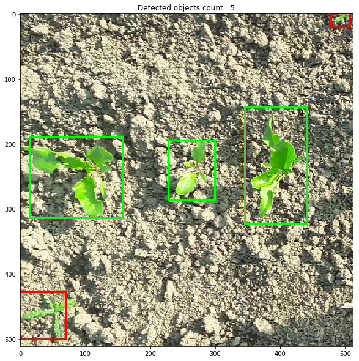

# YOLO V2 with TensorFlow - Eager execution

Here is a jupyter notebook featuring a complete implementation from scratch of YOLOV2 in TensorFlow with eager execution :

- Dataset pipeline with data augmentation
- Training from YOLO pretrained weights
- Visualization of object detection

Original paper : [YOLO9000: Better, Faster, Stronger](https://arxiv.org/abs/1612.08242) by Joseph Redmond and Ali Farhadi.

#### Requirements

- tensorflow 1.11
- imgaug
- cv2

#### Before using the notebook

- Download pretrained weights [here](https://pjreddie.com/media/files/yolov2.weights). Place this weights file in notebook directory and name it `yolo.weights`
- The training requires four directories containing images and annotations :

`train_image_folder/ : contains images files used during training (png format)`

`train_annot_folder/ : contains annotations in PASCAL VOC format (one xml file for each image)`

`val_image_folder/ : contains images files used for validation`

`val_annot_folder/ : contains annotations in PASCAL VOC format`

#### Using the notebook

- Define object's labels to detect (same labels as defined in PASCAL VOC xml file). Example :
~~~python
	LABELS           = ('sugarbeet', 'weed')
~~~

- Define image size in dataset and YOLO grid size. Image size must be YOLO grid size * 32.
~~~python
	IMAGE_H, IMAGE_W = 512, 512
	GRID_H,  GRID_W  = 16, 16 # GRID size = IMAGE size / 32
~~~

- Define train batch size and validation batch size : depends on image size and video card RAM.
~~~python
	TRAIN_BATCH_SIZE = 10
	VAL_BATCH_SIZE   = 10
~~~

- Define path to dataset directories.
~~~python
	# Train and validation directories

	train_image_folder = 'data/train/image/'
	train_annot_folder = 'data/train/annotation/'
	val_image_folder = 'data/val/image/'
	val_annot_folder = 'data/val/annotation/'
~~~

That's it, just run notebook cells to train YOLO on your own data.

#### Example of use

YOLO model trained on sugarbeet and weed dataset (two labels) :

#### Credits

Many thanks to these great repositories:

https://github.com/experiencor/keras-yolo2

https://github.com/allanzelener/YAD2K

and to this very good explanation of the YOLO V2 loss function:

https://fairyonice.github.io/Part_4_Object_Detection_with_Yolo_using_VOC_2012_data_loss.html
